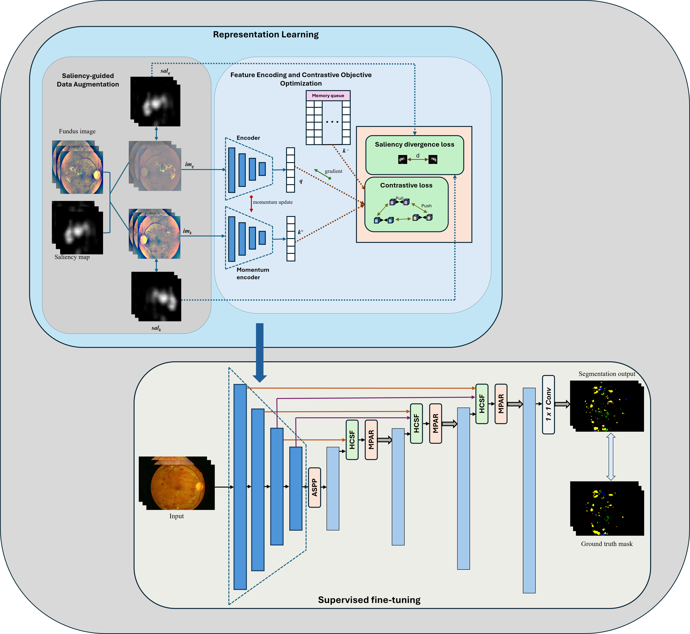

# Saliency-guided Contrastive Pretraining and Attention-enhanced Decoding for Semi-Supervised Diabetic Retinopathy Lesion Segmentation

This repository contains the full implementation of SCADNet, a two-stage semi-supervised framework for diabetic retinopathy (DR) lesion segmentation. The method integrates saliency-augmented contrastive learning, EfficientNet-B0 encoder pretraining, and a U-Net-style decoder enhanced with HCSF and MPAR modules for improved lesion awareness.

## Stage-1: Saliency-Augmented Contrastive Pretraining
Uses an EfficientNet-B0 encoder trained with MoCo-style contrastive learning.
Integrates saliency-guided augmentations, where lesion-aware saliency maps generate informative positive pairs.
## Stage-2: SCADNet Lesion Segmentation Model
Initializes the encoder using Stage-1 pretrained weights.
Trained using Dice + Cross-Entropy loss 

  

